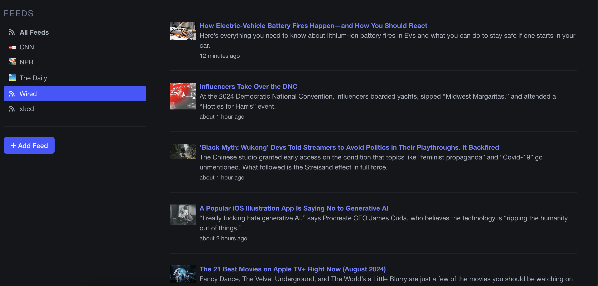

# RSS Reader

[Demo](https://rss-reader-irkm.onrender.com/) - This is hosted on a "Hobby" instance, so it may take a minute to spin up when you first visit.

## Overview

**RSS Reader** is a simple, open-source RSS reader built with Ruby on Rails. This project allows users to create accounts, add RSS feeds, and view articles in a streamlined, minimalist interface. Designed to be lightweight and easy to use, RSS Reader offers essential features for managing and reading RSS feeds, making it an excellent addition to any portfolio.

## Features

- **User Accounts**: Sign up and manage your personal RSS feeds.
- **Add/Edit/Delete Feeds**: Easily add new RSS feeds by providing a name and URL. You can also edit or delete existing feeds as needed.
- **Navigation Panel**: Quickly access your feeds through a simple navigation panel.
- **Article Viewing**: View articles from individual feeds or aggregate all articles from your feeds into a single view.
- **Flash Messages**: User-friendly error messages guide you when issues arise with feed sources.

## Installation

To set up the RSS Reader locally, follow these steps:

1. **Clone the Repository**:
    ```bash
    git clone https://github.com/wheresfrank/rss_reader.git
    cd rss-reader
    ```

2. **Install Dependencies**:
    ```bash
    bundle install
    ```

3. **Setup the Database**:
    ```bash
    rails db:setup
    ```

4. **Start the Rails Server**:
    ```bash
    rails server
    ```

5. Visit `http://localhost:3000` in your browser to start using RSS Reader.

## Technologies Used

- **Ruby on Rails**: The core framework used to build the application.
- **Turbo Rails**: Enhances page updates and navigation without needing full-page reloads.
- **Bulma CSS Framework**: Provides a clean, minimalistic UI.
- **Stimulus Controllers**: Used for minimal JavaScript interactions to enhance user experience.

## Usage

1. **Sign Up/Log In**: Create an account to start managing your feeds.
2. **Add Feeds**: Save a feed by entering its name and RSS URL.
3. **Manage Feeds**: Edit or delete feeds at any time.
4. **View Articles**: Choose to view articles from a specific feed or aggregate articles from all feeds in one place.

## Future Plans

- **Uniform Article Formatting**: Improve the consistency and readability of articles.
- **Favorites**: Mark feeds as favorites to display them at the top of the list.
- **Feed Categories**: Organize feeds into user-defined categories for better management.

## Contribution Guidelines

At this time, the RSS Reader is primarily a portfolio project, but contributions are welcome. Please open an issue or submit a pull request if you'd like to contribute.

## License

This project is licensed under the AGPL-3.0 License. See the [LICENSE](LICENSE) file for more details.

## Screenshots


*Example of the RSS Reader interface.*
